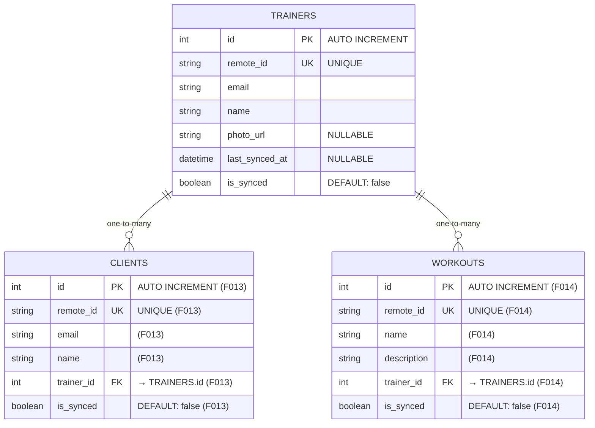

# Database Schema - Personal Trainer App

## Current Schema (Generated by Drift)

### ER Diagram



## Tables

### ✅ TRAINERS_TABLE (F012 - COMPLETE)

| Column | Type | Constraints | Purpose |
|--------|------|-------------|---------|
| `id` | INTEGER | PK, AUTOINCREMENT | Primary key |
| `remote_id` | TEXT | UNIQUE, NOT NULL | Sync deduplication |
| `email` | TEXT | NOT NULL | Trainer contact |
| `name` | TEXT | NOT NULL | Display name |
| `photo_url` | TEXT | NULLABLE | Profile picture URL |
| `last_synced_at` | DATETIME | NULLABLE | Last sync timestamp |
| `is_synced` | BOOLEAN | DEFAULT: false | Offline-first sync flag |

**Storage**: `~/.local/share/personal_trainer_app/app_database.sqlite`

---

### 📋 CLIENTS_TABLE (F013 - PENDING)

| Column | Type | Constraints | Purpose |
|--------|------|-------------|---------|
| `id` | INTEGER | PK, AUTOINCREMENT | Primary key |
| `remote_id` | TEXT | UNIQUE, NOT NULL | Sync deduplication |
| `email` | TEXT | NOT NULL | Client contact |
| `name` | TEXT | NOT NULL | Display name |
| `trainer_id` | INTEGER | FK → TRAINERS(id) | Relationship to trainer |
| `is_synced` | BOOLEAN | DEFAULT: false | Offline-first sync flag |

---

### 📋 WORKOUTS_TABLE (F014 - PENDING)

| Column | Type | Constraints | Purpose |
|--------|------|-------------|---------|
| `id` | INTEGER | PK, AUTOINCREMENT | Primary key |
| `remote_id` | TEXT | UNIQUE, NOT NULL | Sync deduplication |
| `name` | TEXT | NOT NULL | Workout name |
| `description` | TEXT | NOT NULL | Workout details |
| `trainer_id` | INTEGER | FK → TRAINERS(id) | Relationship to trainer |
| `is_synced` | BOOLEAN | DEFAULT: false | Offline-first sync flag |

---

## Design Patterns

### Offline-First Sync
- Every table has an `is_synced` flag (defaults to `false`)
- `lastSyncedAt` tracks when data was last synced with backend
- `remoteId` is unique to prevent duplicate syncs
- Local changes are saved first, then synced when connectivity returns

### Relationships
- **One Trainer** has **many Clients**
- **One Trainer** has **many Workouts**
- Foreign keys enforce referential integrity

### Schema Versioning
- Current `schemaVersion` = 1 (in `lib/database/app_database.dart`)
- Increment when adding new tables or modifying schema
- Migration logic handled in `onUpgrade` callback

---

## Generated Code

Drift generates the following from table definitions:

1. **Data Classes** (Freezed models)
   - `TrainersTableData` - immutable data holder
   - Serialization support via `toJson()`/`fromJson()`

2. **Table Info** (Drift internals)
   - `$TrainersTableTable` - SQL generation
   - Column metadata and constraints
   - Integrity validation

3. **DAOs** (Data Access Objects)
   - `TrainerDao` (F015)
   - Methods for CRUD operations
   - Query builders

See: `lib/database/app_database.g.dart` (generated)

---

## Running Queries

### Using Drift ORM (Recommended)
```dart
// In your repository or data source
final trainers = await database.trainersTable.select().get();
final trainer = await database.trainersTable.select()
    .where((tbl) => tbl.remoteId.equals('abc123'))
    .getSingleOrNull();
```

### Using sqlite3 CLI
```bash
sqlite3 ~/.local/share/personal_trainer_app/app_database.sqlite

# View schema
.schema

# Query
SELECT * FROM trainers_table;
SELECT * FROM trainers_table WHERE is_synced = 0;
```

### Using DB Browser GUI
1. Install: `sudo apt-get install sqlitebrowser`
2. Launch: `sqlitebrowser`
3. Open file: `~/.local/share/personal_trainer_app/app_database.sqlite`
4. Browse tables, run queries, view data visually

---

## Next Steps

- **F013**: Add `clients_table.dart` with foreign key to trainers
- **F014**: Add `workouts_table.dart` with foreign key to trainers
- **F015**: Create `TrainerDao` for CRUD operations
- **F016**: Create `ClientDao` for CRUD operations
- **F017**: Create `WorkoutDao` for CRUD operations
